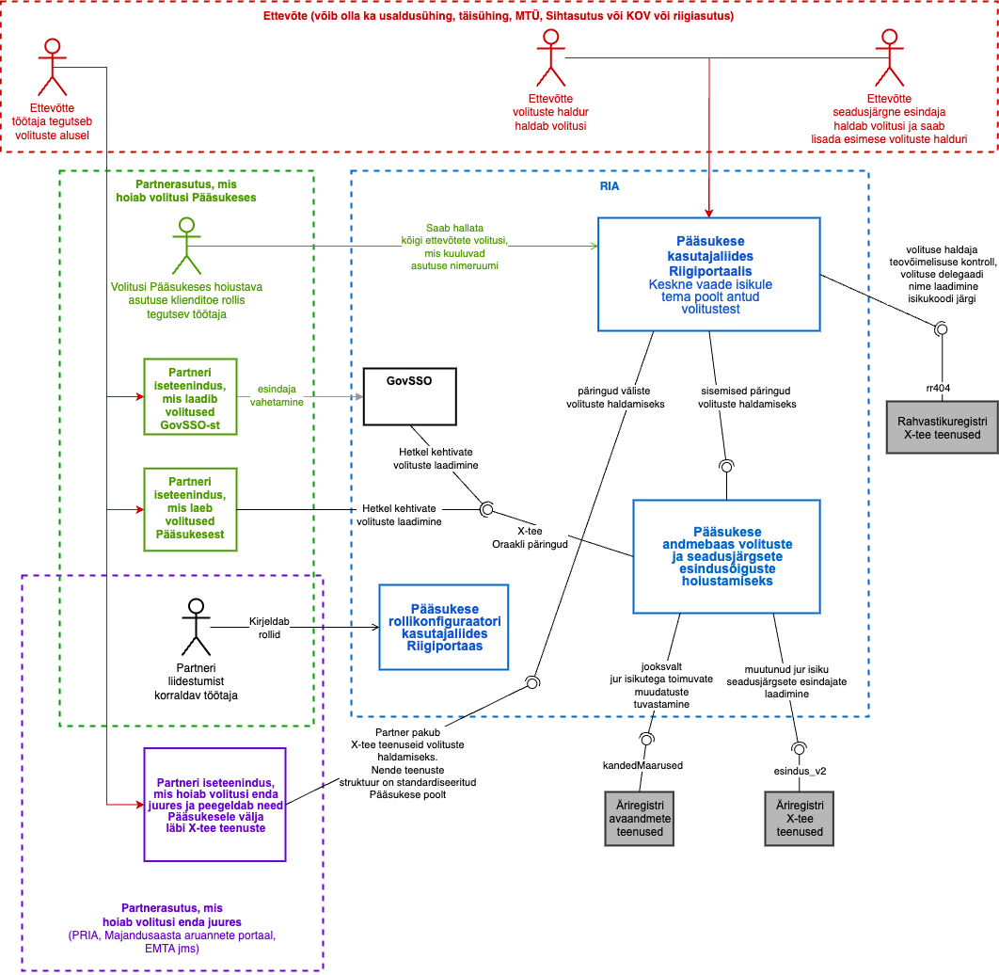

# Infosüsteem Pääsuke

Pääsukesega liidestuv asutus saab oma Pääsukese rolle hallata läbi [eesti.ee](http://eesti.ee/)-s asuva rollikonfiguraatori kasutajaliidese. 

Iga ettevõtja, kes on äriregistri andmetel asutuse esindusõigusega isik, saab ise jagada [Pääsukeses](https://www.eesti.ee/volitused/et) volitusi teenuste kasutamiseks.

**Pääsuke pakub & tarbib**
* Pääsuke pakub kasutajale keskset ülevaadet tema poolt antud või talle antud volituste kohta terves riigi infosüsteemis.
* Pääsuke pakub X-tee liideseid volituste küsimiseks (nn oraakliliides) ja volituste muutmiseks ning volituste haldamise kasutajaliidest [eesti.ee](http://eesti.ee/) portaalis.
* Pääsuke tarbib Äriregistri ja Rahvastikuregistri X-tee teenuseid.

**Ettevõte/asutus, millel on registrikaardile märgitud ühisesindusõigus või esindusõiguse erisus, saab Pääsukeses volitusi anda:**

* ringkinnitamise teel (ringkinnitamise kohta saab lugeda [Pääsukese juhendist ptk 3.6 Ringkinnitamine)](https://www.eesti.ee/static/files/Volituste_juhend_EE.pdf) 
* saates taotluse RIA kasutajatoele ([taotlus docx vormingus](https://www.eesti.ee/static/files/volituste_taotlus.docx), [taotlus rtf vormingus](https://www.eesti.ee/static/files/volituste_taotlus.rtf)). Taotlus peab olema allkirjastatud ühise esindusõigusega juhatuse liikmete poolt ning tuleb saata digiallkirjastatult aadressile help@ria.ee või paberil postiga aadressile Riigi Infosüsteemi Amet, Pärnu mnt 139a, Tallinn, 15169.

**Näited rollidest, mida saab Pääsukeses anda ja eemaldada:**

* "[Eesti.ee](http://eesti.ee/): Ettevõtte volitatud esindaja (eesti.ee teenuste osas)" - annab õiguse kasutada kõiki [eesti.ee](http://eesti.ee/) portaali teenuseid menüüs "E-teenused" (v.a eriõigustega teenused, nagu näiteks rahvastikuregistri teenuste õigused).
* "Pääsuõiguste haldus: [Eesti.ee](http://eesti.ee/) portaali ettevõtjateenusete volituste haldur" - annab õiguse hallata [eesti.ee](http://eesti.ee/) ettevõtjatele mõeldud teenuste volitusi lehel [Volitused](https://www.eesti.ee/volitused/et).
* "[Eesti.ee](http://eesti.ee/): Töövõimetuslehtede täiendaja - annab õiguse vaadata, täiendada ja kinnitada ettevõtja töötajate töövõimetuslehtede andmeid [eesti.ee](http://eesti.ee/) portaalis.
* "[Eesti.ee](http://eesti.ee/): Tõendiga A1 (E101) seotud ettevõtjateenuste kasutaja" - annab õiguse kasutada ettevõtjale mõeldud tõendiga A1 (E101) seotud teenuseid eesti.ee portaalis.

**Erinevad viisid Pääsukesega liidestumiseks**

 Allpool nähtav joonis illustreerib, kuidas

1. Ettevõte tahab anda oma töötajale volitusi erinevate iseteeninduste kasutamiseks.
    * Ettevõtte seadusjärgne esindaja võib anda töötajale volitused ise
    * Ettevõtte seadusjärgne esindaja võib ka anda volitused volituste haldurile, kes tegeleb edasi volituste haldamisega seadusjärgse esindaja eest.
2. Ettevõtte töötaja kasutab nende volituste alusel mõnd partnerasutuse iseteenindust.
    * Üldjuhul selline ettevõtte töötaja Pääsukest ei kasuta aga kui tuleb, siis ta näeb endale antud volitusi eraisiku vaatest ja soovi korral saab nendest sealt loobuda
    * Kui sellisel töötajal ei ole volituste halduri õigusi, siis ta ettevõtet Pääsukeses esindada ei saa
3. Enamik partnerasutusi (joonisel rohelisega) annavad kogu volituste hoiustamise üle Pääsukesele ja laadib volitused sealt siis kui kasutajad nende süsteemi tulevad.
    * Need partnerasutused saavad volitused kas laadida X-tee teenuse vahendusel või läbi liidestumise GovSSO-ga
    * Sellised partnerasutused saavad ka luua kasutajatoe rolli oma asutuse töötajale. Selline töötaja saab hallata kõigi ettevõtete volitusi asutuse nimeruumi(de) osas.
4. Osad partnerasutused (joonisel violetsega) hoiavad volitusi enda juures, aga teevad nende haldamise Pääsukese kasutajaliidese kaudu keskselt kättesaadavaks.
    * Nende asutuse volitusi Pääsukesest üle X-tee laadida ei saa
    * ääsuke laadib nende partnerite juurest volitused, et pakkuda ettevõtetele volituste haldamist keskselt läbi Pääsukese kasutajaliidese
5. Mõlemat tüüpi partnerasutused saavad kirjeldada rollikonfiguraatoris oma rollide nimetused ja kirjeldused ja rollide omavahelised reeglid.

Pääsukeses volitusi hoiustav volituse omanik saab neid hallata Pääsukeses.
Väljaspool Pääsukest volitusi hoiustatavate volituste omanik saab seda teha nii Pääsukese rollikonfiguraatoris kui ka oma süsteemis.  Selliste volituste halduri analoog on nn "Symlink" volitus. Kui kasutajal tuvastatakse alusrolli olemasolu, siis see lisatakse kasutajale automaatselt Pääsukese poolt ja seda salvestatakse Pääsukese poolel kuni 7 päeva. Selle kohta täpsemalt saab lugeda (LINK teisele lehele) 

Rollide haldamine leiab aset toodang-keskkonnas, aga esmalt on võimalik muudatused paigaldada toogangueelsesse keskkonda Stage, mis asub [stage.eesti.ee](http://stage.eesti.ee/)'s ja kuhu RIA annab teistele asutustele ligipääsu taotluse alusel.
Uuele liidestujale peab RIA esmalt looma rollipaki ja liidestuva asutuse juht peab andma oma asutuse töötajatele volituse kasutada Pääsukese Rollikonfiguraatori toodangkeskkonna kasutajaliidest.

