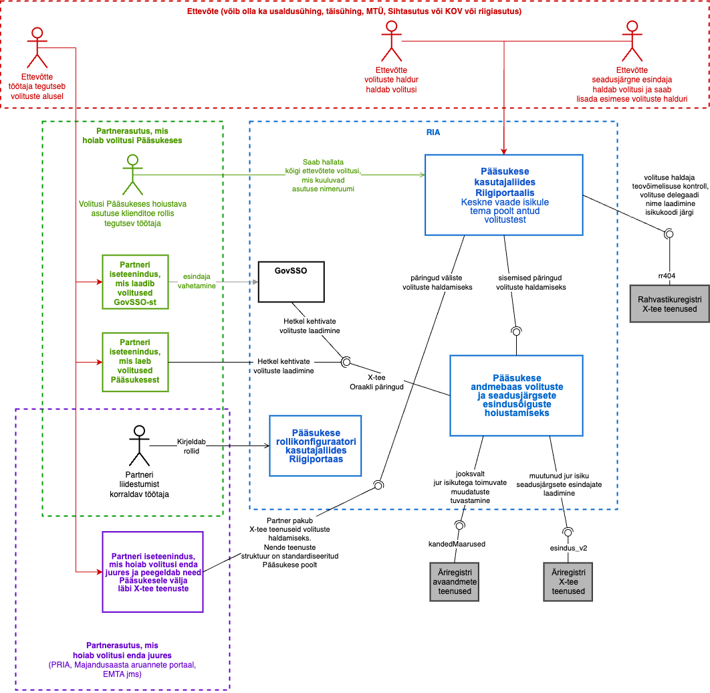

## Üldandmed ja kontekst

### Pääsukese eesmärk

Korrastada Eesti digiriigi volituste süsteem, pakkudes keskset, selget ja kasutajasõbralikku platvormi ligipääsuvolituste haldamiseks. Süsteem säästab teisi asutusi vajadusest luua ja hallata oma volituste süsteeme.

### Seos äriprotsessidega

Pääsuke toetab juriidiliste ja füüsiliste isikute esindusõiguste ja volituste kontrolli ning delegeerimist teistes riigi või erasektori infosüsteemides.

### Omanikud ja osapooled

Infosüsteemi omanik ja arendaja on **Riigi Infosüsteemi Amet (RIA)**.

Liidestuva infosüsteemi omanik vastutab enda infosüsteemiga seotud volituste äriloogika toimimise ning juriidilise korrektsuse eest.

RIA saab pakkuda kasutajatuge volituste andmiseks, tingimusel, et liidestuva infosüsteemi omanik on RIA-le edastanud selge ja üheselt mõistetava ärikirjelduse (mis volitusi, kellele ja millistel tingimustel on õigus anda). Lisada vabas vormis ärikirjeldus/juhis toodangu taotlusele.

## Kasutajad ja rollid

### Sihtrühm

Infosüsteemi lõppkasutajad on füüsilised isikud, kes tegutsevad mingis rollis.

Lõppkasutajad on liidestunud infosüsteemi kasutajad ning liidestuva infosüsteemi omaniku töötajad (nt kasutajatoe rollis olevad isikud).

Pääsukest saavad kasutada vaid eesti isikutunnistust omavad isikud ja Eestis registreeritud juriidilised isikud.

### Kasutajarollid

Lõppkasutaja rollid:

* **Seadusest tulenev esindaja:** Isik, kellel on Äriregistri andmetel õigus juriidilist isikut kõikides toimingutes esindada. Pääsuke tuvastab nii ainuesindusõiguse, ühisesindusõiguse kui esindusõiguse erisuse kui see on korrektselt Äriregistris kajastatud (masinloetaval kujul).
* **Esindatav:** Isik (sh juriidiline isik), kes annab teisele isikule volituse enda nimel tegutseda.
* **Esindaja:** Isik, kes saab õiguse esindatava nimel määratud rollis tegutseda.

## Äriteenused ja funktsionaalsus 

### Pakutavad teenused

1. **Volituste haldamise kasutajaliides** on integreeritud riigiportaali eesti.ee ja on kättesaadav lehelt "Volitused".

Volituste haldamise kasutajaliideses on võimalik:

* volitusi vaadata
* volitusi lisada
* volitusi edasi volitada
* volitusi kopeerida
* volitustest loobuda
* volitusi tagasi võtta
* volitusi taotleda
* volitusi digiallkirjastada

Detailse ülevaate kasutajaliidese võimalustest saab Pääsukese [DEMO videost](https://www.youtube.com/watch?v=Pq4PZ2dPo_0&list=PLNPWRftK1TNp9GZtHUw3jjIXOK3CMuUA2&index=4&t=81s.){:target="_blank"} ja [Volituste haldamise juhendist](https://www.eesti.ee/static/files/Volituste_juhend_EE.pdf){:target="_blank"}

Lähiajal lisanduvad funktsionaalsused: volituste ajaloo vaatamine

2. Liidestunud infosüsteemi omanikule on olemas ka **kasutajaliides rollide seadistamiseks,** so **Rollikonfiguraator**, mille kohta leiad info [SIIT.](https://e-gov.github.io/PH-Doku/files/rollide_konfigureerimine_v011.pdf){:target="_blank"}

3. **RIA kasutajatoe teenus:** Iga liidestuja saab valida, kas volitusi saab juriidilise isiku eest kasutajaliideses anda ka RIA kasutajatugi. RIA kasutajatugi saab volitusi ettevõtte eest lisada esindusõiguslike isikute poolt allkirjastatud taotluse alusel. Kasutajatoe teenuse jaoks on vajalik esitada vabas vormis ärikirjeldus/juhis ja esitada see koos toodangu taotlusega.
   
### Pääsuke pakub & tarbib
* Pääsuke pakub kasutajale keskset ülevaadet tema poolt antud või talle antud volituste kohta terves riigi infosüsteemis.
* Pääsuke pakub X-tee liideseid volituste küsimiseks (nn oraakliliides) ja volituste muutmiseks ning volituste haldamise kasutajaliidest [eesti.ee](http://eesti.ee/){:target="_blank"} portaalis.
* Pääsuke tarbib Äriregistri ja Rahvastikuregistri X-tee teenuseid (vt allpool olevat joonist).

## Põhiprotsessid ja liidestumise viisid

**Liidestujale rollipaki (volituste) loomine Pääsukese rollikonfiguraatoris:** Liidestunud infosüsteemi omanik (joonisel nimetatud partnerasutus) saab Pääsukest kasutada enda infosüsteemi ligipääsude haldamiseks. Partneri liidestumist korraldav töötaja kirjeldab rollid rollikonfiguraatoris. Pääsukeses seadistatakse kes, kellele ja milliseid volitusi annab (volitusi hoiate Pääsukeses või liidestuva infosüsteemi juures) ning liidestunud infosüsteemi poolel seotakse volitus ligipääsu õigusega (ligipääsuõigusi hoiustatakse alati liidestunud infosüsteemi juures). 

**Volituste andmine kui esindaja on juriidiline isik (joonisel punasega):**

* Juriidilise isiku nimel saavad Pääsukeses volitusi anda seaduse järgne esindaja või esindajad (esindusõiguse tuvastab Pääsuke Äriregistrist).
* Seadusejärgne esindaja või esindajad saavad määrata enda asutuse volituste halduri, kes hakkab esindusõiguslike isikute eest volitusi andma (selle funktsionaalsuse jaoks peab kindlasti olema seadistatud rollipakki volitus tüübiga AUTORISATION_MANAGER).
* Liidestunud infosüsteemi (partnerasutuse) esindusõiguslik isik saab anda enda asutuse töötajale anda kasutajatoe (roll tüübiga HELPDESK) volituse, kes saab enda infosüsteemi volitusi hallata ka infosüsteemi kasutajate eest (joonisel rohelisega)
* Asutuse/ettevõtte töötajale antakse volitus, millega saab siseneda liidestunud infosüsteemi (joonisel rohelisega)

**Füüsilise isiku esindamine:** Kui tegemist on füüsilise isikule mõeldud volitustega siis saab volituse anda vaid füüsiline isik ise (nt füüsiline isik volitab teist füüsilist isikut).

Liidestumisel tuleb otsustada, mis liidestumise viisi kasutada. Tehnilise kirjeldusega saab tutvuda [SIIN.](https://e-gov.github.io/PH-Doku/Integrating){:target="_blank"}

Antud joonisel rohelisega on kirjeldatud liidestumist, kus volitusi hoitakse Pääsukeses ja lillaga on kujutatud liidestumist, kus volitusi hoiatakse partneri iseteeninduses (nimetatud ka kui kaugkinnitus).

