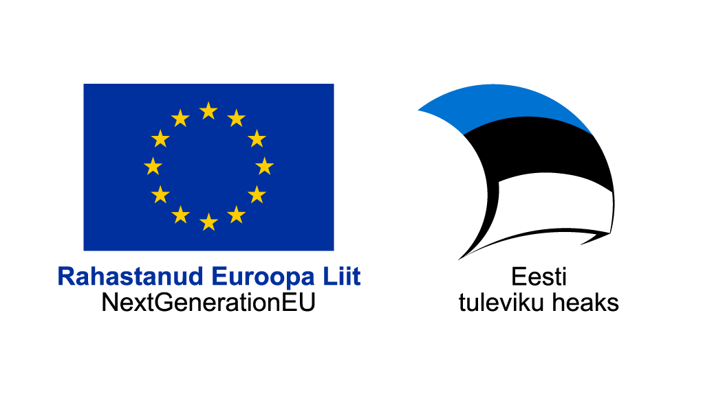

## Volituste haldamise infosüsteem Pääsuke

Pääsuke on Eesti e-riigi elektrooniline keskselt hallatav volituste haldamise infosüsteem, kus kasutaja näeb tema poolt või talle antud volitusi üle terve Eesti riigi erinevate infosüsteemide.

Pääsukese eesmärk on korrastada olemasolev Eesti digiriigi volituste keeruline maailm ja pakkuda uue kvaliteediga innovatiivset, selget ja kasutajasõbralikku volituste haldamise süsteemi. Pääsukese kasutuselevõtt säästab vajadusest investeerida ja luua omaenda volituste haldamise infosüsteem ning säästab oma infosüsteemi haldamiskuludest jm kaasnevatest kuludest.

Pääsukese kliendiks saavad olla kõik ettevõtted ja asutused, kelle olemasolev volituste haldamise infosüsteem on ajale jalgu jäänud ja kellel on soov see uue süsteemi vastu välja vahetada. Tulevikus ei ole välistatud skoobi laiendamine ka eraisikutele.

Pääsuke :

* toetab uute lahenduste kasutuselevõttu ja paindlikku riigivalitsemist ning on digiväelise Eesti üks alustalasid.
* on kõrgkäideldav ja turvaline.
* on ärilist väärtust pakkuv lahendus, mille kasutegur on selgelt ajas ja rahas mõõdetav.
* Pääsukesega integreerumine kasulik sest: 

Volitusi saab hallata ühest kesksest kohast – https://eesti.ee portaalist;
Kogu volituste haldamine on kasutaja jaoks mugav;
Pääsuke eemaldab vajaduse luua endale keeruline volituste haldamise infosüsteem;
Tekib selgus olemasolevasse keerulisse volituste maailma;
Pääsuke hoiab kokku aega ja raha

