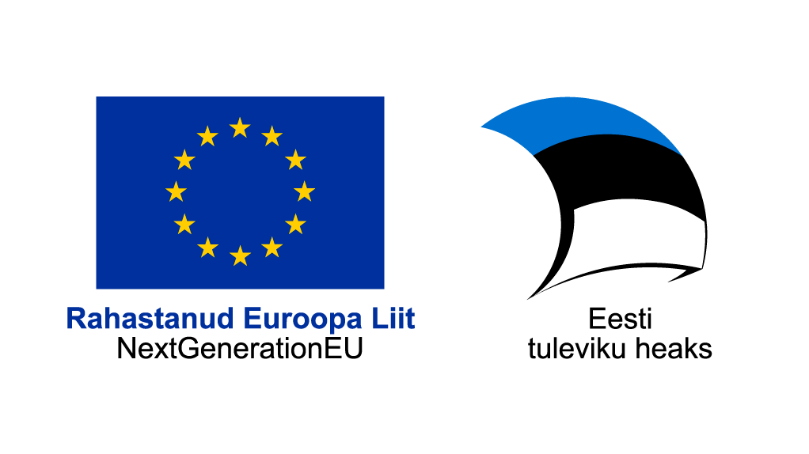

## Mis on infosüsteem Pääsuke?

Pääsuke on Eesti e-riigi keskne volituste haldamise infosüsteem, mis võimaldab kasutajatel hallata erinevate iseteeninduskeskkondade juurdepääse ühest kesksest kohast. 

Pääsuke asub eesti.ee keskkonnas lehel https://www.eesti.ee/eraisik/et/volitused

**Pääsukese eesmärk** on korrastada olemasolev Eesti digiriigi volituste keeruline maailm ja pakkuda uue kvaliteediga innovatiivset, selget ja kasutajasõbralikku volituste haldamise süsteemi. 

## Pääsukese väärtus

### Liidestujale
* puudub vajadus arendada oma volituste infosüsteemi;
* vähenevad arendus- ja halduskulud;
* volitused on keskselt hallatavad;
* ligipääsude kontroll muutub läbipaistvamaks.

### Kasutajatele
* üks keskne ülevaade kõikidest volitustest;
* lihtsam ligipääs riigi e-teenustele;
* vähem käsitsi asjaajamist;
* turvalisem ja selgem õiguste haldamine.

## Käesoleva infomaterjal on mõeldud

**Ärikasutajale**, kes saab siinse teabe alusel hinnata PÄÄSUKESE sobivust, liidestustööde mahtu ja teha otsuse PÄÄSUKESE kasutuselevõtuks.

**Arendajale**, kes leiab siit kogu vajaliku tehnilise teabe asutuse e-teenuste liidestamiseks Pääsukesega. 

**Volituste haldurile ja liidestuja poolsele kontaktisikule** - liidestunud infosüsteemi vastutav kontaktisik, saab info, mida pärast liidestumist silmas pidada ning infot Pääsukese uuenduste kohta.

[Pääsukese demo](https://www.youtube.com/watch?v=Pq4PZ2dPo_0&list=PLNPWRftK1TNp9GZtHUw3jjIXOK3CMuUA2&index=4&t=81s.)

